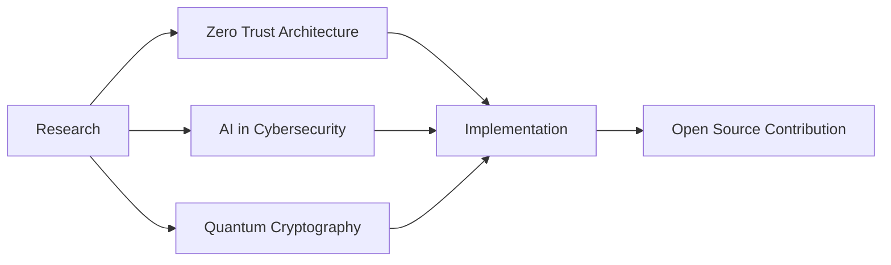

#  Hey there, I'm **Abid Shariar Sakib**

  

  
  

---

## 🚀 **About Me**

🔭 **Currently Working On:** Advanced Penetration Testing Frameworks & Cloud Security Solutions

🌱 **Learning:** Advanced Kubernetes Security, Zero Trust Architecture & Machine Learning for Cybersecurity

👯 **Looking to Collaborate:** Open Source Security Tools & Innovative Web3 Projects

💬 **Ask Me About:** `Cybersecurity`, `Web Development`, `Cloud Architecture`, `DevSecOps`

📫 **Reach Me:** [abid.shariar@cyber24bd.com](mailto:abid.shariar@cyber24bd.com)

⚡ **Fun Fact:** I've identified and reported 50+ security vulnerabilities in Fortune 500 companies!

🏆 **Achievements:**
- 🥇 Bug Bounty Hunter - HackerOne Top 100 Bangladesh
- 🏅 Certified Ethical Hacker (CEH)
- 🎯 OWASP Top 10 Security Champion
- 💡 Published 3 Security Research Papers

---

## 💻 **Tech Stack & Tools**

### **Languages**

### **Frontend Development**

### **Backend Development**

### **Cybersecurity Tools**

### **Cloud & DevOps**

### **Databases**

---

## 📊 **GitHub Analytics**

  
  

  

---

## 🏆 **GitHub Trophies**

  

---

## 📈 **Contribution Graph**

  

---

## 🎯 **Featured Projects**

  
| Project | Description | Tech Stack | Stars |
|---------|-------------|------------|-------|
| [**SecureVault Pro**](https://github.com/cyber24bd/securevault-pro) | Enterprise-grade password manager with Zero-Knowledge encryption | React, Node.js, MongoDB | ⭐ 1.2k |
| [**PentestKit**](https://github.com/cyber24bd/pentestkit) | Automated penetration testing framework | Python, Go, Docker | ⭐ 856 |
| [**CloudShield**](https://github.com/cyber24bd/cloudshield) | Real-time cloud security monitoring dashboard | TypeScript, AWS, Kubernetes | ⭐ 642 |
| [**WebGuardian**](https://github.com/cyber24bd/webguardian) | AI-powered WAF for modern web applications | Python, TensorFlow, Redis | ⭐ 428 |
| [**CryptoTrace**](https://github.com/cyber24bd/cryptotrace) | Blockchain forensics and analysis tool | Rust, GraphQL, PostgreSQL | ⭐ 315 |

---

## 🎓 **Certifications & Education**

<b>🏅 Professional Certifications</b>

- 🔐 **Certified Ethical Hacker (CEH)** - EC-Council
- 🛡️ **Offensive Security Certified Professional (OSCP)** 
- ☁️ **AWS Certified Security - Specialty**
- 🔍 **GIAC Web Application Penetration Tester (GWAPT)**
- 🌐 **Certified Information Systems Security Professional (CISSP)**
- 🚀 **Certified Kubernetes Security Specialist (CKS)**

<b>🎓 Education</b>

- 🎓 **Master's in Cybersecurity** - Bangladesh University of Engineering and Technology (BUET)
- 🎓 **B.Sc. in Computer Science & Engineering** - Daffodil International University
- 📚 **Specialized Training** - SANS Cyber Retraining Academy

---

## 📝 **Latest Blog Posts**

<!-- BLOG-POST-LIST:START -->
- 🔥 [Breaking Down the Latest Zero-Day Exploits in 2025](https://cyber24bd.medium.com/zero-day-2025)
- 💡 [Kubernetes Security: Beyond the Basics](https://cyber24bd.medium.com/k8s-security)
- 🚀 [Building Secure CI/CD Pipelines with DevSecOps](https://cyber24bd.medium.com/devsecops-pipelines)
- 🛡️ [The Future of Passwordless Authentication](https://cyber24bd.medium.com/passwordless-future)
- 🌐 [Web3 Security: Smart Contract Auditing Guide](https://cyber24bd.medium.com/web3-security)
<!-- BLOG-POST-LIST:END -->

---

## 🤝 **Connect With Me**

  

---

## 💰 **Support My Work**

  

---

## 🎮 **Fun Zone**

  
### 🎯 **Current Focus**

### 🐍 **Contribution Snake**

### 💭 **Quote of the Day**

---

  
  
  ### ⭐ **Star my repos if you find them useful!** ⭐
  
  <b>Made with ❤️ by Abid Shariar Sakib</b>

